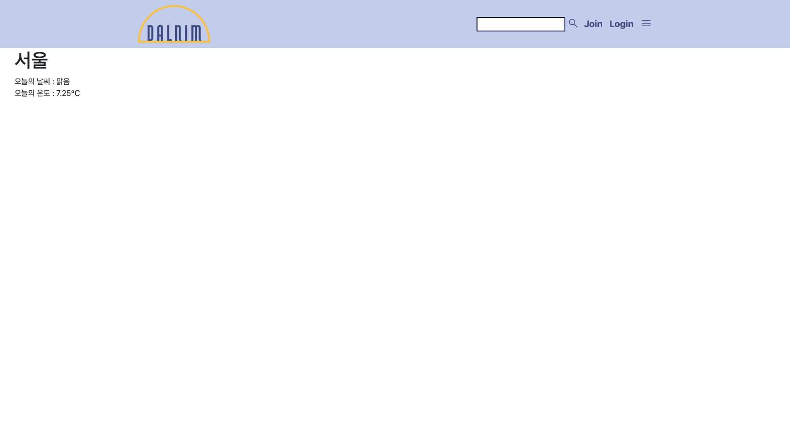

# 3월 29일

## 진행
1. API 연동 후 테스트 완료
2. favicon 삽입

## 문제점 - 해결
1. views에 API 호출 함수 import
    - views.py 화면에 표시하고자 하는 파일이 정의
    - views.py 파일의 정의에 따라 화면에 표시할 파일을 찾아 사용자 브라우저에 출력한다.
    - 직접 실행하지 않고 html 실행하니 해결 (테스트 진행 방법 틀림)
2. article 부분에 API 삽입 후 내용이 header에 가림
    - header에 높이가 설정이 되어있지 않아 발생함 => header에 높이 주어 해결
3. favicon 삽입 후 아이콘이 보이지 않음
    - liveshare의 문제점으로 이미지 파일을 navigator가 아니면 저장 오류 => 해결

## 해야할 일
1. 날씨별 이미지 정하기
2. 조건에 따라 날씨 이미지와 날씨 출력
3. article 에 컨텐츠 틀 정하기
4. 폰트

