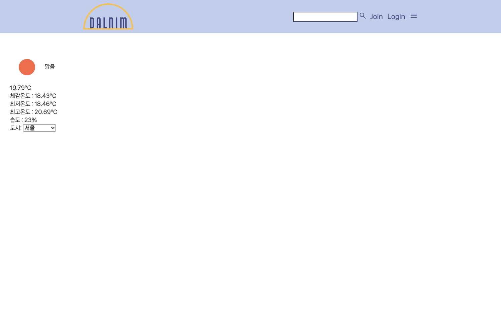
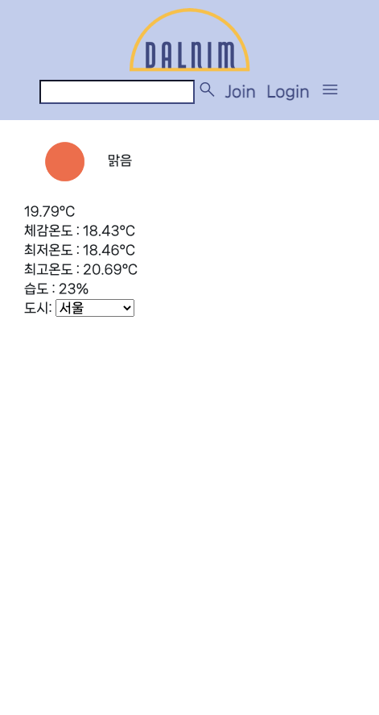

# 3월 30일

## 진행
1. API 연동
    - 날씨 이름 description으로 불러옴
    - 날씨 icon 삽입
    - 지역 select해서 날씨 정보 불러옴
2. urls.py 분리
3. 지역 선택해서 submit 버튼 누르지 않고, 'onchange="this.form.submit()"'로 변경
4. 폰트-눈누

## 문제점 - 해결
1. 창 크기 줄였을 때, wrap으로 nav가 내려올 시 article의 글들이 가려짐
    - header 높이 150px로 주어 해결
2. API에서 불러온 icon이 url로만 표시됨
    - views에서 url 방식 방식 바꿔 해결
    - url 오류 났으나 중첩 따옴표 문제여서 해결
3. 날씨 지역 선택 후 기본값이 서울로 고정
    - views에서 if문으로 지역을 선택하면 context에 추가
    - 기본값으로 나타나도록 html if문에 'selected_city' 변수 사용하여 해결

## 해야할 일
1. article 컨텐츠 틀 잡아서 test
2. 날씨 section 구성
3. 반응형 페이지 시작
    - display: grid 학습

