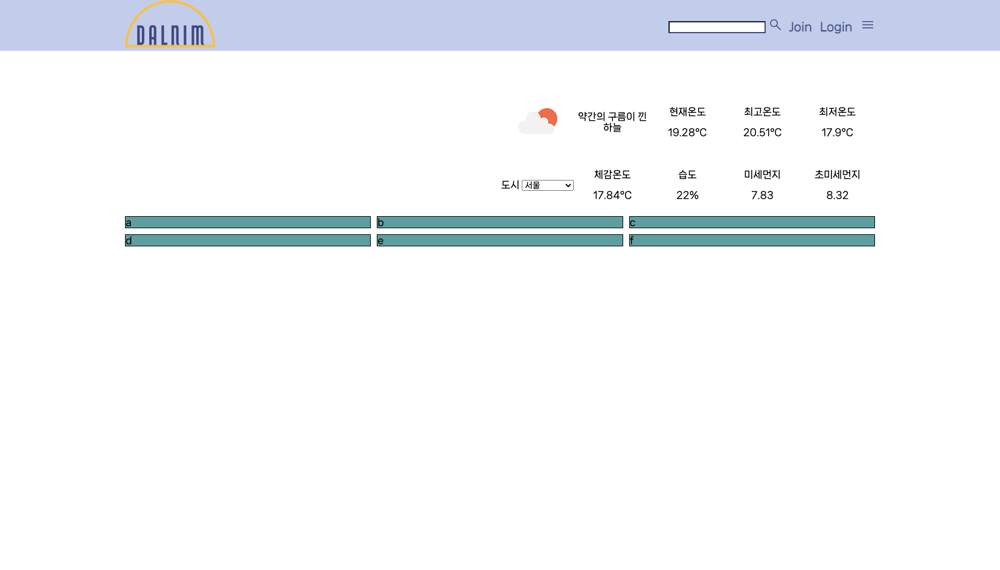
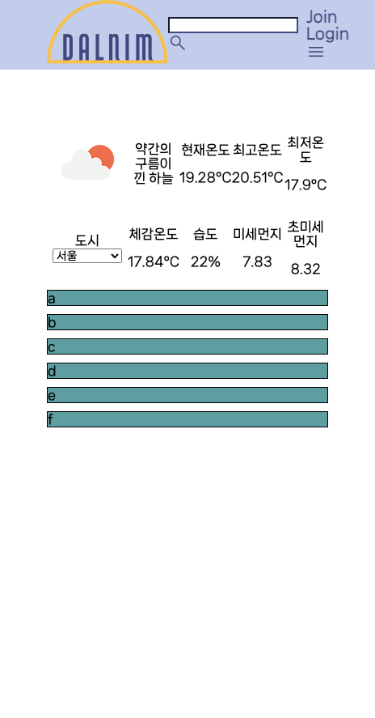

# 4월 3일

## 진행
1. grid 적용하여 반응형 페이지 구성
2. 날씨 section grid로 칸 구분하여 가시성 높임

## 문제점 - 해결
1. article의 section 부분에 클래스 적용이 되지 않음
    - liveshare의 오류 중 하나
2. nav와 article 양 옆 공간을 동일하게 주기 위해 width 클래스 적용 => nav의 구조가 무너짐
    - 기존 nav 클래스에 존재하던 조건들을 width 클래스에 옮겨 해결
3. grid
    - 글을 작성해나갈 section 부분의 반응형 페이지 구성
      - display: gird; 와 미디어 쿼리를 사용하여 해결
    - 날씨가 존재하는 section과 아래 section을 따로 grid 적용
      - container를 두개 작성하여 따로 구분해주어 해결
    - 날씨 section의 가시성이 떨어짐
      - grid를 사용하여 반응형은 없애고, 칸을 구분하여 넣어줌

## 해야할 일
1. nav flex-wrap 적용
2. 미세먼지나 초미세먼지 수치에 따른 정도 표기
3. 날씨 section 구성
4. contents 생각하기

