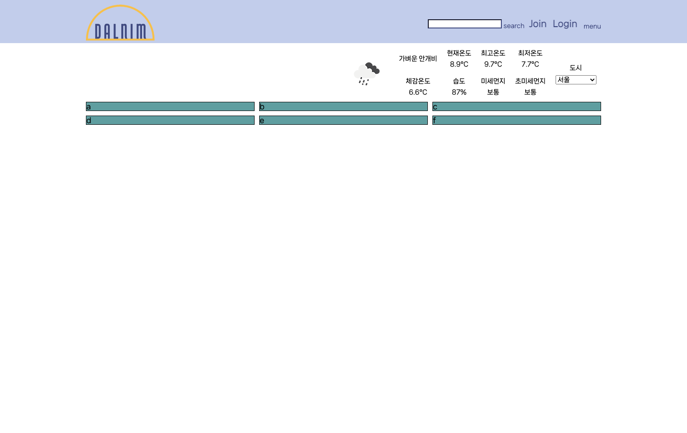
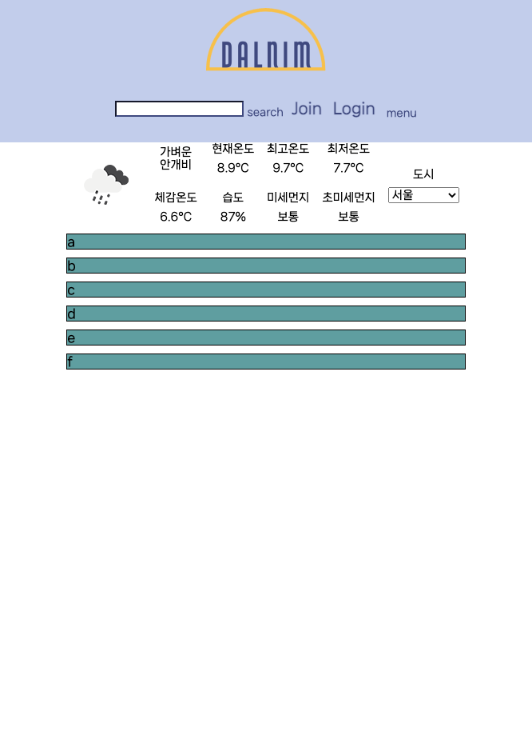

# 4월 5일

## 진행
1. navbar 구조 완성
2. 날씨 section 구조 완성
3. 온도 소수점 첫째자리까지 적용
4. 미세먼지, 초미세먼지 범위에 따른 정도 표기

## 문제점 - 해결
1. navbar 구조가 무너져 창의 크기가 줄었을 때, flex-wrap이 적용되지 않음
    - 창의 크기가 max-width: 768px 일 때
      - grid-template-columns: 1fr 1fr;, justify-items: center; 적용하여 창의 크기가 줄었을 때, 2행, 가운데 정렬 되도록 함
    - 창의 크기가 min-width: 768px 일 때
      - grid-template-columns: 1fr 2fr;, 오른쪽 div에는 justify-content: flex-end; 를 주어 해결
2. 날씨 section
    - icon의 크기에 맞춰서 나머지 div들도 비슷한 크기를 가져 div들 사이의 간격이 너무 먼 문제가 발생
      - grid 영역을 조정 (5*2 => 7*2)
      - 날씨 icon을 2*2 공간을 주어 해결

## 해야할 일
1. 메인 페이지 contents 구상

