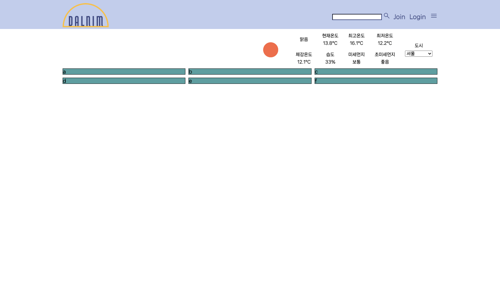
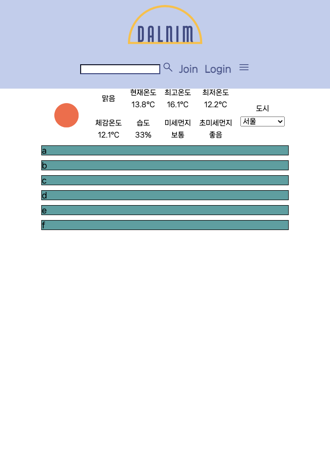

# 4월 6일

## 진행
1. 불필요한 코드 정리
2. 코드 주석 달기
3. contents 구상
    - API
      - 뉴스 API
      - 날씨 왼쪽 div에 기사 제목

    - 웹 크롤링
      - 뉴스

    - 유튜브 영상
      - 새로고침할 때마다 새로운 영상
    
    - 게시판 최신 글
      - image input받아 썸네일처럼 사용

## 해야할 일
1. 뉴스 API, 크롤링, 스크래핑 사용법 예습
    - 가장 적합한 방법 정하여 진행

2. 뉴스 삽입할 때 구상 생각해오기

