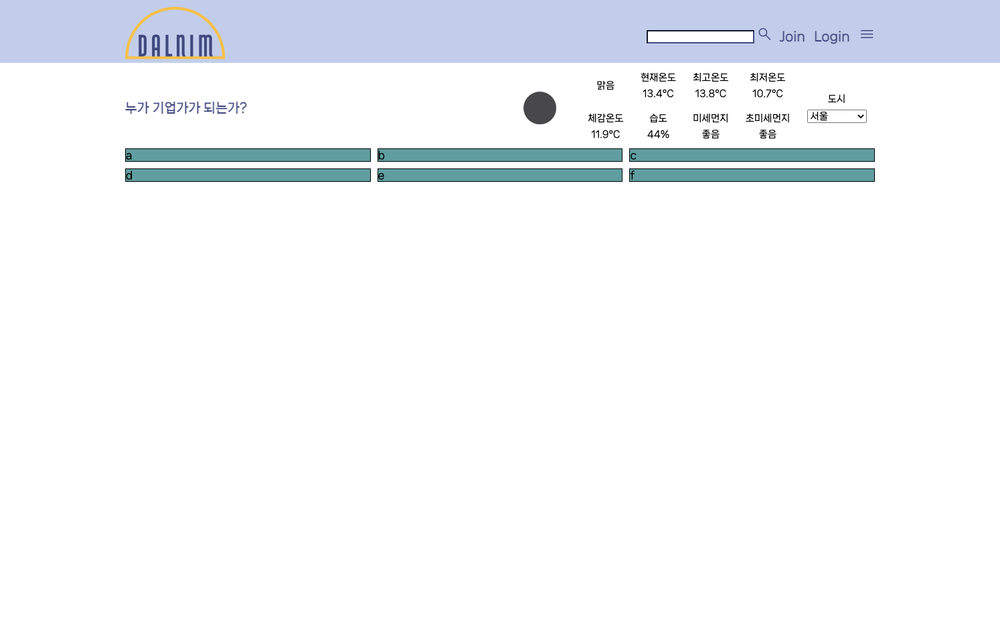
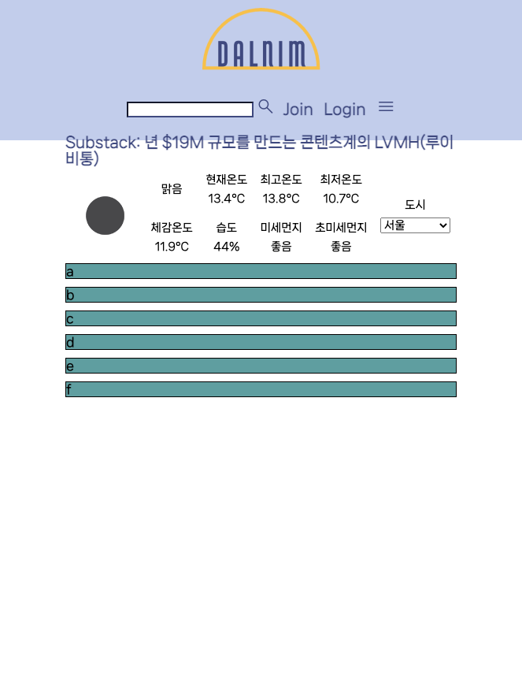

# 4월 10일

## 진행
1. 뉴스 - 스크래핑으로 결정
2. 날씨 section 왼쪽에 위치시킴
3. news section 무한 자동 carousel 구현

## 문제점 - 해결
1. news_dict 에서 value만 출력
    - python 문법처럼 values(), items() 를 썼으나 출력이 안됨
    - () 를 삭제하여 해결

2. news section carousel
    - 무한 반복, 속도
      - js에서 showSlides() 함수를 정의하여 해결
    - 구성 해결 X

## 해야할 일
1. news section 구성 수정
2. 영상 main 페이지에 삽입하여 재생

