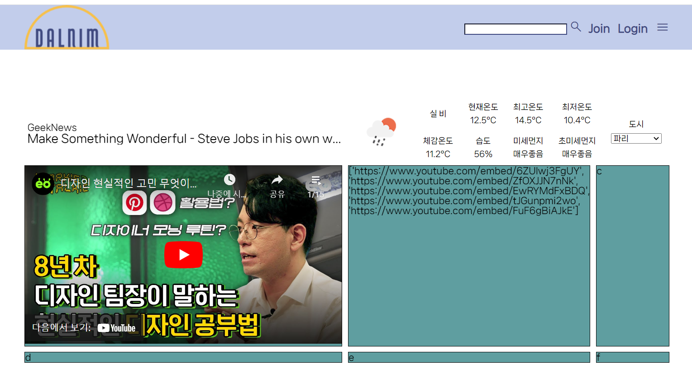
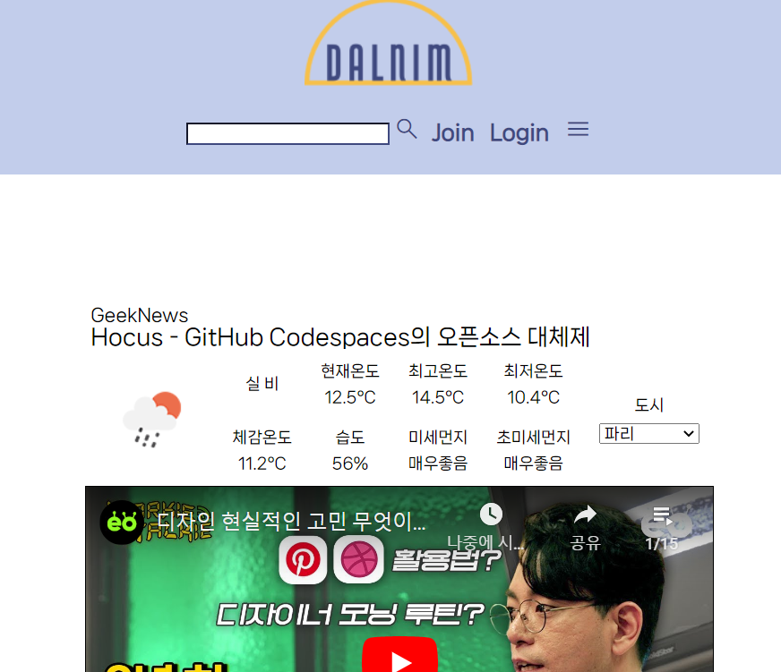

# 4월 12일

## 진행
1. navbar 구성 수정
2. news section 수정
3. 날씨 section 도시 select 코드 수정
4. 메인 페이지에서 유튜브 영상 자동 재생

## 문제점 - 해결
1. navbar 구성
    - 토글 버튼 누를 때마다 아래의 뉴스나 날씨 section을 가리는 현상 발생 (창의 사이즈 크기에 상관X)
      - header에 높이 + z-index(fixed 시 위로 나타나도록) + article 미디어 쿼리 수정하여 해결

2. 날씨 section 도시 select 코드
    - 기존: html에서 가장 긴 코드를 차지
    - 최신: views에서 cities를 정의, html에서 for문 사용하여 코드 간략히 수정

3. news section 구성 수정
    - 기사 제목이 길어지면 자동 줄바꿈
    - text가 길어졌을 때 ... 이 나타나도록 수정하였으나 날씨 section이 밀리고 text가 잘리는 현상 발생
      - 그리드 1fr 1fr 에서 50% 50% 로 수정
      - 부모 클래스에 적용되었던 css 요소를 a 태그에 직접 할당하여 해결

## 해야할 일
1. 유튜브 인기 급상승 top 5 영상 가져오기
    - 랜덤 실행

2. 추가 컨텐츠 구상

3. footer

