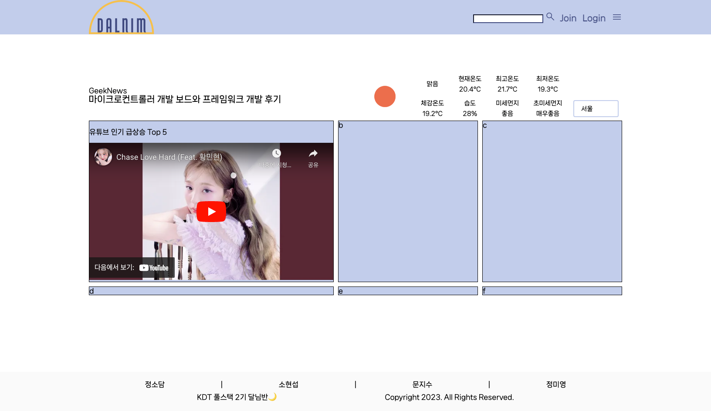
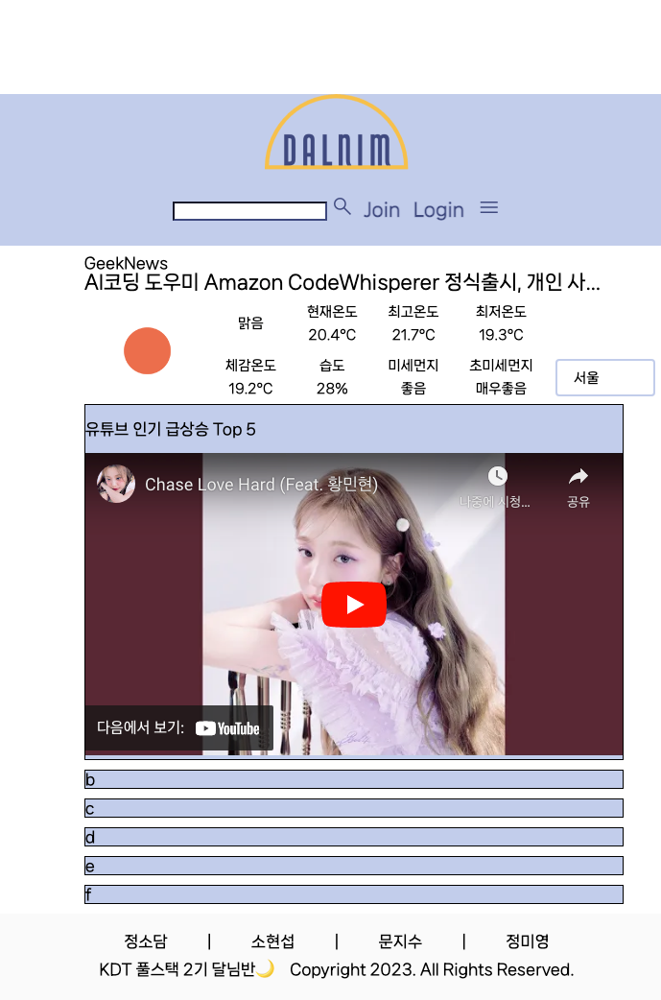

# 4월 17일

## 진행
1. navbar base.html 로 이동
2. footer 내부 구조
3. base.html 구조
4. 컨텐츠 구상
    - 쇼핑 (ex.알구몬)
    - 가수별 최신 앨범 or 출시 앨범 알림
    - 영화, 음악, 도서, 웹툰 추천
    - 원하는 카테고리 순위
    - 각자 한 파트씩 맡아서 구상해오기

## 해야할 일    
1. 각자 파트 구현
    - 영화 (movie) - 소담 - div > b
    - 음악 (music) - 지수 - div > c
    - 도서 (book) - 현섭 - div > d
    - 웹툰 (webtoon) - 미영 - div > e

