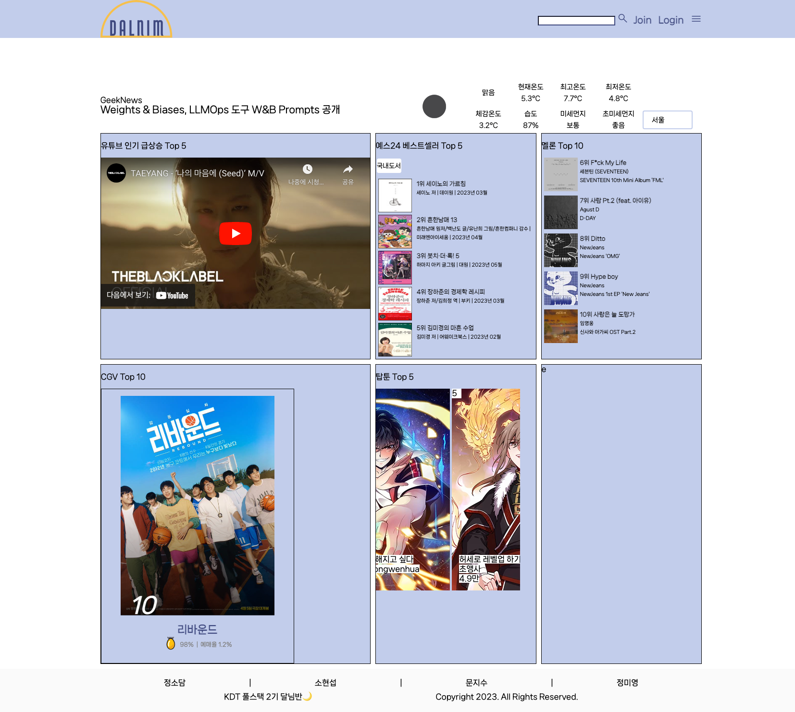
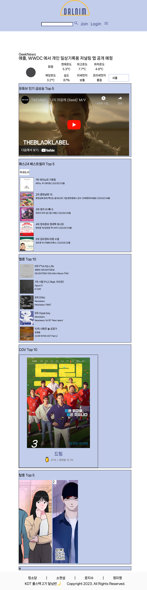

# 4월 26일

## 진행
1. melon, webtoon merge
2. 디자인 수정

## 문제점 - 해결
1. melon top 10 차트 크롤링 진행 중 앨범 커버 이미지 url 적용 불가
    - html for 반복문에서 'song.' 써주지 않아 발생

2. movie 관련 웹 페이지 출력 오류
    - python 버전 차이로 인한 오류
    - 3.9로 통일하여 해결

3. permission denied, 403 에러
    - token 등 방식 모두 시도했으나 실패

## 해야할 일    
1. accounts, articles 생성, 연결
2. webtoon 디자인 수정

