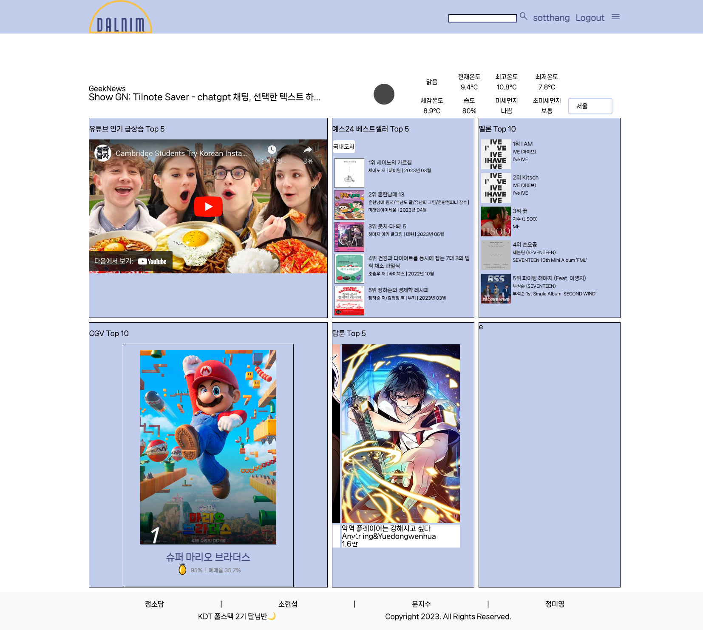
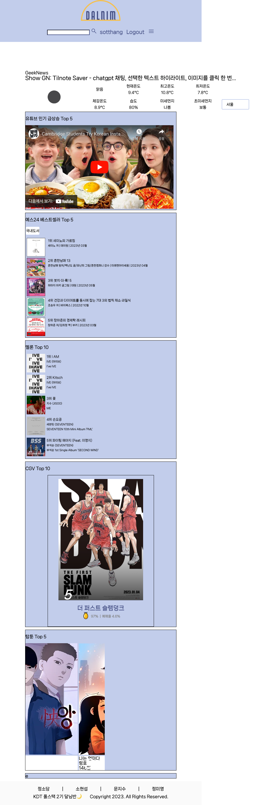

# 4월 27일

## 진행
1. accounts, articles 생성, 연결

## 문제점 - 해결
1. SuspiciousFileOperation at /create/
Detected path traversal attempt in '/8/no-image.png'
    - 경로 순회 오류: 이미지 업로드 경로

2. detail에서 이미지가 나오지 않음
    - 이미지 경로 문제
    
- 1, 2번 해결
    - static(settings.MEDIA_URL, document_root=settings.MEDIA_ROOT) 넣어 해결
    - 기존에는 static root만 존재했음

3. UnboundLocalError at /create/
local variable 'image_form' referenced before assignment
    - views.create 에서 if, else 문 밖 info_form, image_form 정의하여 해결

## 해야할 일    
1. accounts 디자인 수정
2. main 페이지(e)에서 게시글 표시
3. main.css, base.css 분리

