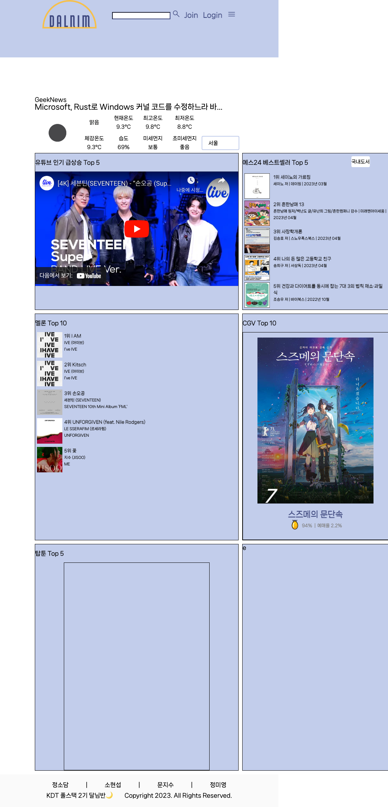

# 5월 1일

## 진행
1. base.css, main.css 분리
2. accounts 디자인 수정

## 문제점 - 해결
1. static 폴더 내의 파일을 불러오지 못하는 문제 발생
    - settings.py의 static dir 재설정하여 해결

2. accounts form 디자인 수정 위해 부트스트랩 가져왔으나 다른 모든 css를 덮는 문제 발생 + 그리드도 깨짐
    - 클래스가 중복되어 발생함
    - 필요한 곳에만 부트스트랩 요소 추가하여 해결

## 해야할 일    
1. articles와 accounts의 클래스 차이로 search, a태그 차이 => 변경해야 함
2. 부트스트랩을 사용하지 않기 위해 form-control 코드만 받아와서 사용 고려 (scss)
3. accounts form 디자인 수정해야함

