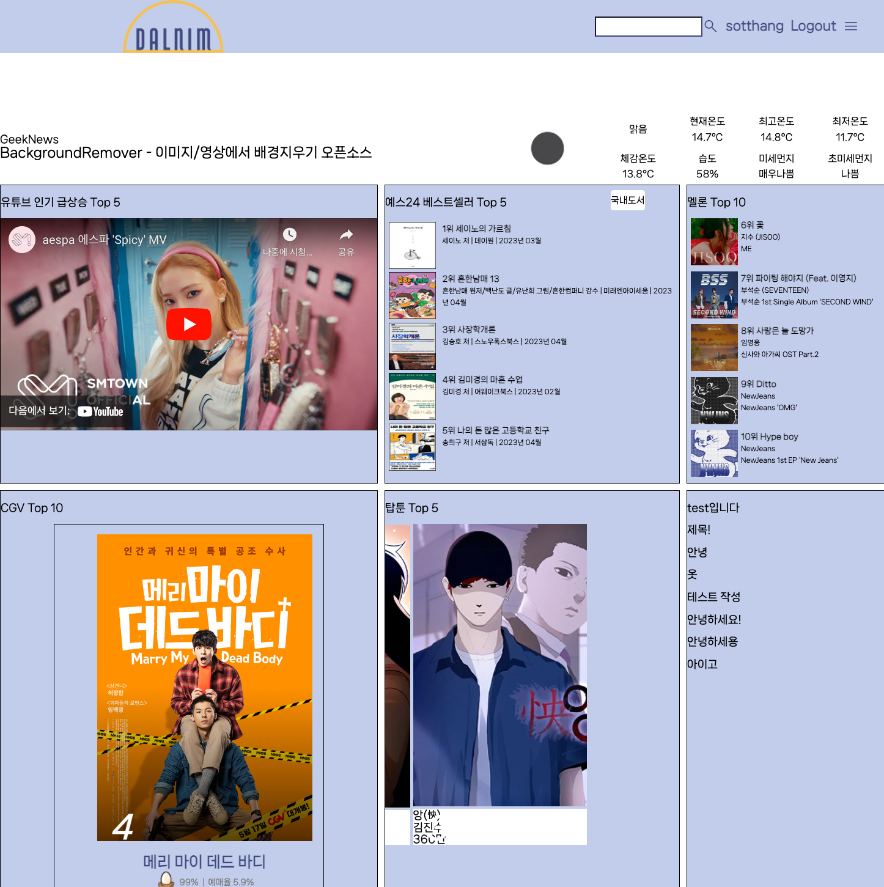
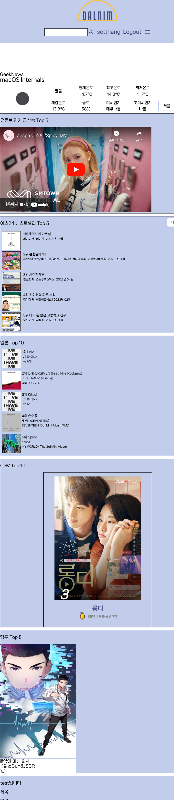
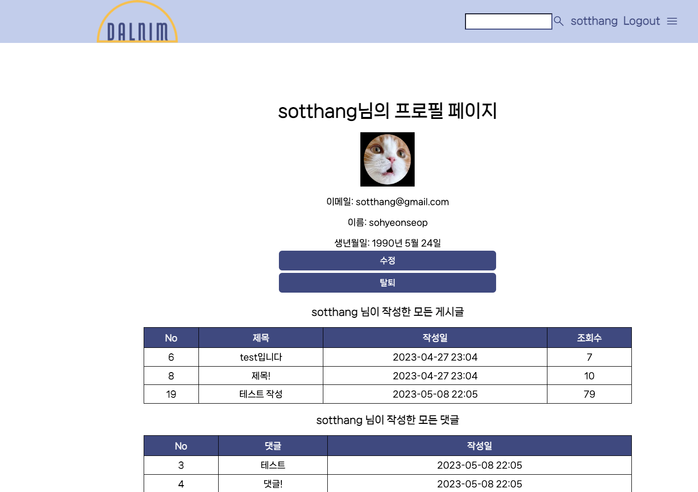
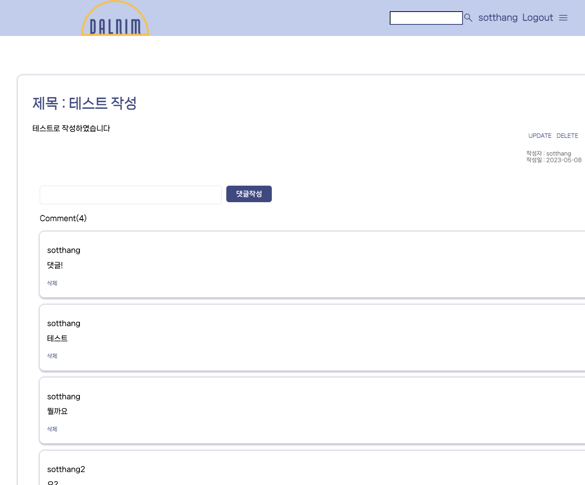

# 5월 10일

## 진행
1. detail page 수정

## 문제점 - 해결
1. comment의 user 프로필 이미지가 출력되지 않음
    - The 'profile_img' attribute has no file associated with it.
    - 원인 파악 중

## 해야할 일    
1. 목록 페이지 생성
2. main page 요청 횟수 수정

