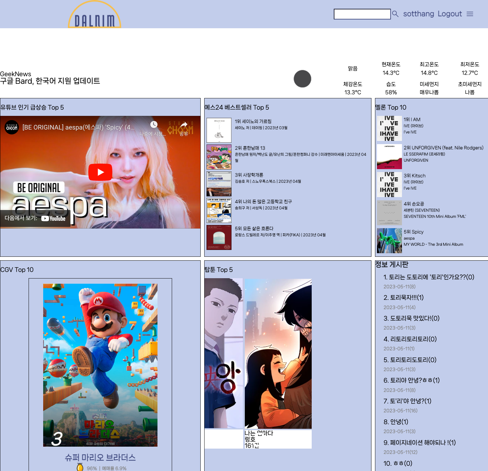
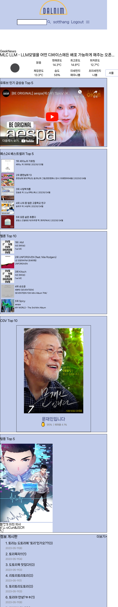
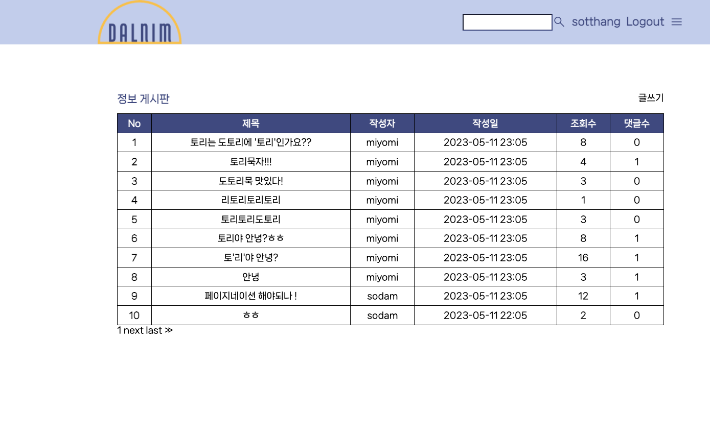

# 5월 11일

## 진행
1. 목록 페이지 생성
2. main page 요청 횟수 수정

## 문제점 - 해결
1. comment의 user 프로필 이미지가 출력되지 않음
    - The 'profile_img' attribute has no file associated with it.
    - 프로필 이미지가 없는 경우 alt="{{ comment.user.profile_img.url }}" 에서 에러 발생, alt="{{ comment.user.profile_img }}" 로 하면 해결

2. main page runserver 시에만 정보 요청
    - apps.py 작성

## 해야할 일    
1. 전체적 디자인 수정

